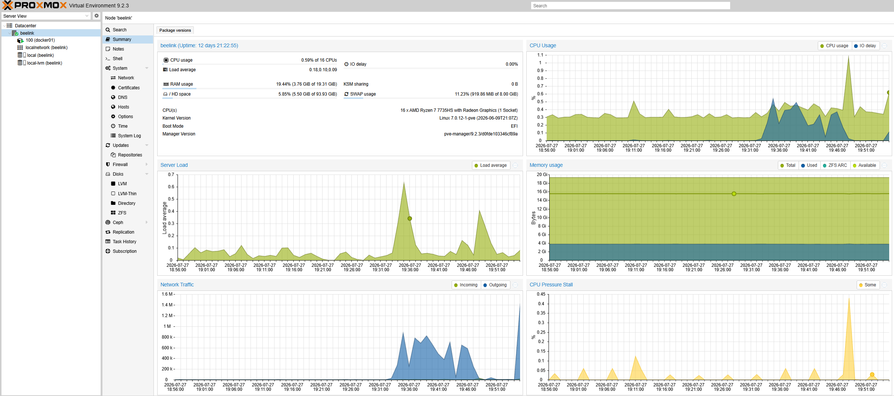
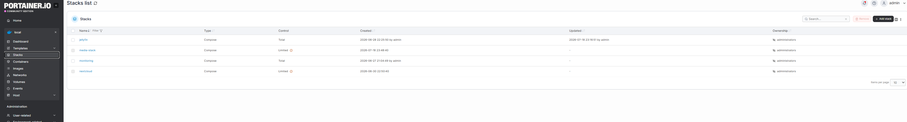
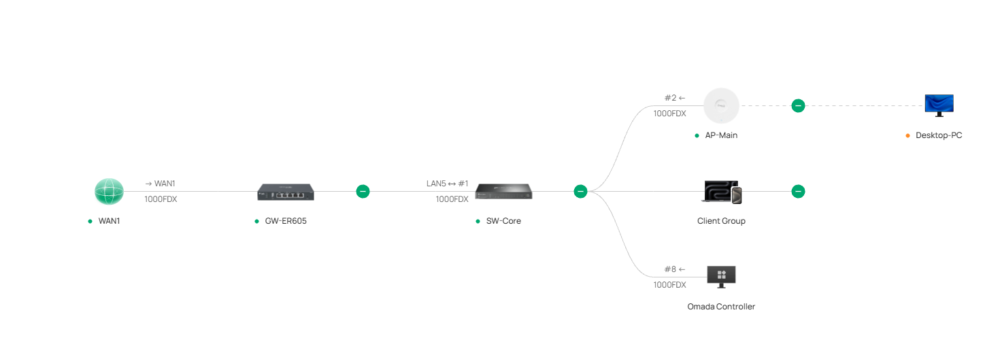
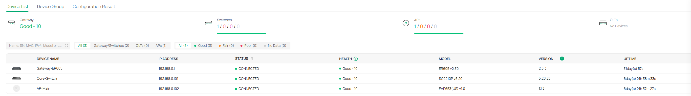
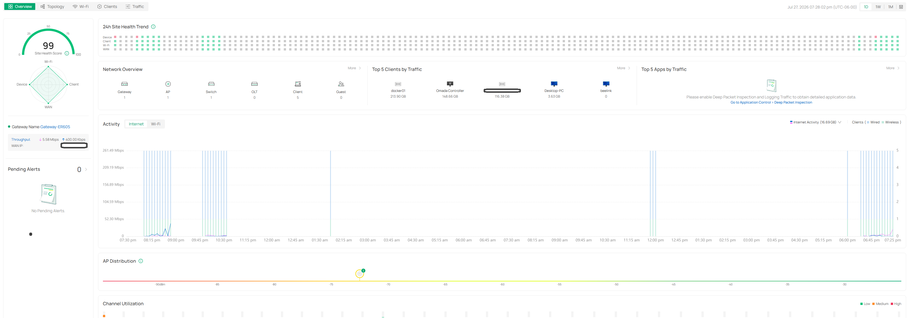
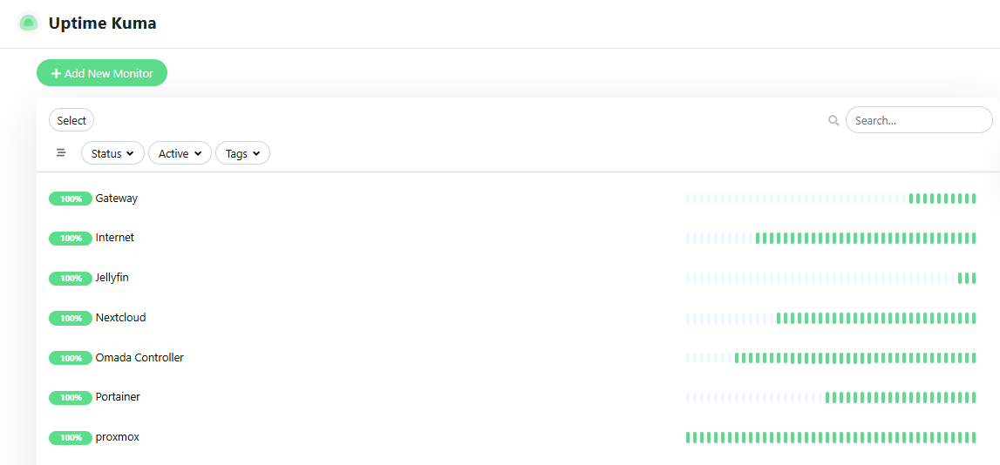

# Beelink Home Lab

Enterprise-style virtualization and self-hosted infrastructure built to develop practical experience in systems administration, networking, Linux, virtualization, Docker, storage management, and infrastructure troubleshooting.

This environment serves as both a production platform for personal and small-business services and a continuously evolving lab for learning enterprise IT technologies.

> **Note**
>
> Public documentation only. Internal IP addresses, credentials, hostnames, domains, and sensitive configuration details have been sanitized.

---

# Overview

## Objectives

- Develop practical infrastructure experience beyond certification labs
- Build and maintain a production-quality virtualization environment
- Practice Linux administration, networking, Docker, storage management, and troubleshooting
- Deploy useful services supporting personal workflows and Zephyr Visions business operations
- Document engineering decisions, deployment procedures, and troubleshooting for future reference

---

# Architecture

## Infrastructure Overview

```text
                    Internet
                        │
                 TP-Link ER605
                        │
               SG2210P PoE Switch
                        │
                  EAP653 Access Point
                        │
                  Beelink Mini PC
                        │
                   Proxmox VE Host
                        │
                 Debian Docker LXC
                        │
 ┌────────────┬────────────┬────────────┬────────────┐
 │            │            │            │
Nextcloud  Jellyfin   Portainer   Uptime Kuma
│         
 External 20 TB Storage
```

---

### Future Architecture Diagram

## Infrastructure Overview

The following screenshots highlight the core components of the lab, including virtualization, container management, network infrastructure, and system monitoring.

---

## Virtualization Platform



**Figure 1.** Proxmox VE host dashboard displaying virtualization resources, storage allocation, and infrastructure health.

---

## Container Platform



**Figure 2.** Docker Compose stacks managed through Portainer CE for centralized container administration.

---

## Network Infrastructure

### Physical Network Topology



**Figure 3.** Physical network topology managed through the TP-Link Omada SDN controller, illustrating the WAN gateway, managed switch, wireless access point, controller, and connected client devices.

### Managed Network Devices



**Figure 4.** TP-Link Omada SDN managed devices showing the gateway, managed switch, and wireless access point with centralized health monitoring, firmware versions, and uptime.

### Network Health Overview



**Figure 5.** Omada dashboard providing network health, traffic statistics, connected clients, and wireless analytics.

---

## Infrastructure Monitoring



**Figure 6.** Uptime Kuma monitoring infrastructure availability, network devices, and self-hosted services including Proxmox, Portainer, Omada Controller, Nextcloud, Jellyfin, Internet connectivity, and the network gateway.

---

# Engineering Decisions

| Decision | Reason |
|-----------|--------|
| Proxmox VE | Lightweight, enterprise-grade virtualization platform with excellent LXC support |
| Debian LXC | Lower overhead than full virtual machines while maintaining Linux isolation |
| Docker Compose | Repeatable, version-controlled service deployments |
| External 20 TB Storage | Separates operating system storage from large media and business datasets |
| Tailscale | Secure remote administration without exposing management interfaces to the Internet |
| Omada SDN | Centralized management with future support for VLAN expansion and segmentation |

---

# Hardware

| Component | Purpose |
|------------|----------|
| Beelink Mini PC | Primary virtualization host |
| Proxmox VE | Hypervisor |
| Debian LXC | Docker workload container |
| External 20 TB HDD | Shared storage for media, backups, and projects |
| TP-Link ER605 | Router |
| TP-Link SG2210P | Managed PoE switch |
| TP-Link EAP653 | Wireless Access Point |
| Omada Controller | Centralized network management |

---

# Virtualization Platform

The Beelink server runs Proxmox VE as the primary hypervisor.

Current responsibilities include:

- Container management
- Storage management
- Resource allocation
- LXC lifecycle management
- Backup planning
- Infrastructure maintenance


Proxmox VE dashboard showing the Beelink host providing virtualization, storage management, and resource monitoring for the home lab infrastructure.


---

# Container Platform

All application services run inside a Debian LXC using Docker and Docker Compose.

This provides:

- Consistent deployments
- Simple upgrades
- Easy backup procedures
- Service isolation
- Version-controlled configurations


Debian LXC container hosting the Docker application stack, including resource utilization and performance monitoring for containerized services.

---

# Services

| Service | Purpose |
|-----------|----------|
| Nextcloud | Secure file sharing and client portal |
| Samba | Windows file shares |
| Jellyfin | Personal media server |
| Sonarr | Television library automation |
| Radarr | Movie library automation |
| Portainer | Docker management |
| Uptime Kuma | Infrastructure monitoring |
| Tailscale | Secure remote administration |

---

# Storage Design

The external 20 TB drive is organized to support multiple workflows while maintaining separation between application data and media storage.

Current storage includes:

- Business files
- Drone footage
- Client deliverables
- Media libraries
- Docker persistent volumes
- Server backups
- Templates

Key design considerations:

- Windows access through Samba
- Browser-based access through Nextcloud
- Dedicated media paths for Jellyfin
- Separate configuration backups
- Consistent Docker bind mounts

20 TB External Storage

├── Backups
│     ├── Proxmox
│     └── Docker
│
├── Business
│     ├── Clients
│     ├── Deliveries
│     └── Zephyr
│
├── Media
│     ├── Movies
│     ├── TV Shows
│     └── Music
│
├── Drone Projects
│     ├── Thermal
│     ├── INspection
│     └── Mapping
│
└── Docker Persistent Volumes

---

# Networking

The lab is integrated into a TP-Link Omada managed network.

Current networking technologies include:

- TP-Link Omada SDN
- DHCP
- DNS
- Static addressing
- Docker bridge networking
- Tailscale VPN
- Windows SMB networking

Remote administration is performed entirely through Tailscale.

No management services are exposed through router port forwarding.

### Omada Dashboard


---

### Omada Topology


---

### Omada Devices


---

# Monitoring

Infrastructure availability is monitored using Uptime Kuma.

Monitoring currently includes:

- Docker services
- Web applications
- Internal services
- Remote availability

Future improvements include:

- Email alerts
- Service dashboards
- Historical uptime reporting


---

# Troubleshooting Highlights

This lab intentionally serves as a troubleshooting environment for developing practical infrastructure experience.

## Samba Permissions

### Problem

Windows clients could not consistently access shared folders.

### Resolution

Configured Samba permissions, validated Linux ownership, and verified share mappings.

---

## LXC Storage Passthrough

### Problem

External storage required access from Docker containers.

### Resolution

Configured Proxmox bind mounts and passed storage into the Debian LXC.

---

## exFAT Ownership

### Problem

Linux ownership and permissions behaved differently than expected on exFAT storage.

### Resolution

Adjusted mount strategy and Docker permissions while documenting filesystem limitations.

---

## VPN / DNS Conflict

### Problem

Remote administration intermittently failed despite successful VPN authentication.

### Resolution

Identified conflicting VPN software affecting DNS resolution and adapter priority.

Validated connectivity using:

- ping
- nslookup
- service testing

---

## Docker Bind Mounts

### Problem

Applications required consistent shared media paths.

### Resolution

Standardized Docker Compose bind mounts across all containers.

---

# Skills Demonstrated

## Infrastructure

- Proxmox VE
- Linux Administration
- Debian
- LXC Containers
- Docker
- Docker Compose

## Networking

- TP-Link Omada
- DNS
- DHCP
- SMB Networking
- VPN
- Tailscale
- Network Troubleshooting

## Storage

- Bind Mounts
- Linux Permissions
- Shared Storage
- Backup Planning

## Operations

- Infrastructure Documentation
- Service Monitoring
- Troubleshooting
- Root Cause Analysis

---

# Repository Structure

```
beelink-homelab/

├── README.md
├── screenshots/
├── diagrams/
├── docker/
├── docs/
│   ├── networking.md
│   ├── storage.md
│   ├── troubleshooting.md
│   └── backups.md
└── compose/
```

---

# Planned Improvements

- [ ] Create professional network diagram
- [ ] Document Docker Compose deployments
- [ ] Document backup and recovery procedures
- [ ] Add Grafana dashboards
- [ ] Configure automated Proxmox backups
- [ ] Expand monitoring and alerting
- [ ] Implement HTTPS reverse proxy
- [ ] Document disaster recovery process
- [ ] Add Zephyr Visions client delivery integration

---

This repository will continue to evolve as additional services, networking features, monitoring, and automation are implemented.
